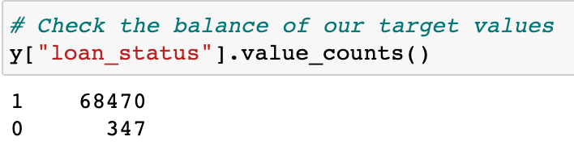
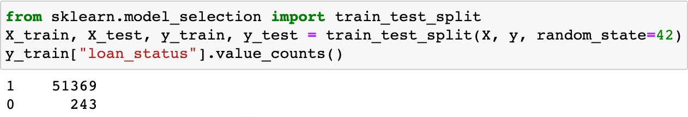
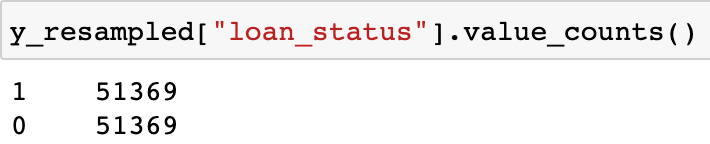
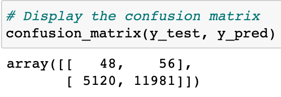
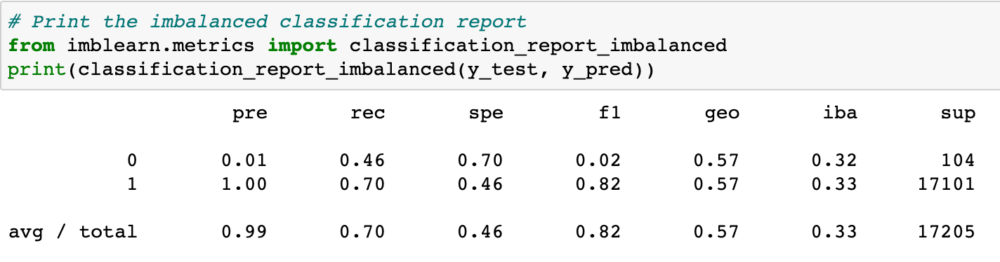
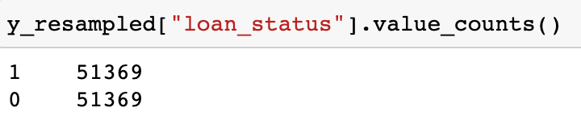
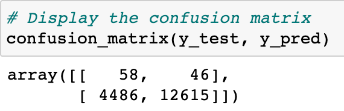
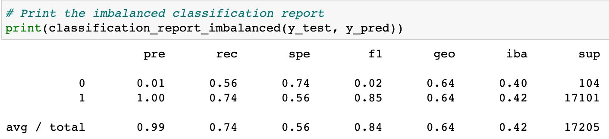

# Credit Risk Analysis

## Purpose
In this analysis, we used the credit card credit dataset from Lending Club to create models that evaluates applications for low or high risk. Each application has many variables, including but not limited to: loan amount, interest rate, annual income, home ownership, etc..

### Models used for analysis
The following six machine learning models are used to check for accuracy in determining risk:
  
  1. Naive Random Oversampling
  2. SMOTE
  3. Random Undersampling
  4. SMOTEENN
  5. Balanced Random Forest Classifying
  6. Easy Ensemble Classifying

### Initial Counts of Minority/Majority Classes in the Dataset
When we split the data into low risk and high risk, the count of each in the dataset is as follows (where 0 is high-risk and 1 is low-risk):

0.5% of the dataset is classified as high-risk, which is a very small subset of the dataset and showing us that this is imbalanced data. When we separate our data into training and testing groups, our training group has the following count:

## Model-Specific Performance
### Naive Random Oversampling
Random oversampling duplicates the records of the minority class (data that is identified as high-risk) to match the size of the majority class. Using random oversampling to resample our training dataset produces the following counts for the high-risk and low-risk groups:

#### Confusion Matrix
The confusion matrix using Naive Random Oversampling show that this model was able to identify low-risk data at much greater rates than high-risk data.

#### Performance of the Logistic Regression Model using Naive Random Oversampling
- Accuracy Score: 58.11%
- Precision: 1%
- Recall: 70%

### SMOTE
SMOTE (Synthetic Minority Over-sampling TEchnique) creates new records in the vicinity of those of the minority class (data that is identified as high-risk) to match the size of the majority class. Using SMOTE to resample our training dataset produces the following counts for the high-risk and low-risk groups:

#### Confusion Matrix
The confusion matrix using SMOTE show that, similar to random oversampling, this model was able to identify low-risk data at much greater rates than high-risk data.

#### Performance of the Logistic Regression Model using SMOTE
- Accuracy Score: 64.76%
- Precision: 1%
- Recall: 74%

### Random Undersampling
SMOTE (Synthetic Minority Over-sampling TEchnique) creates new records in the vicinity of those of the minority class (data that is identified as high-risk) to match the size of the majority class. Using SMOTE to resample our training dataset produces the following counts for the high-risk and low-risk groups:

#### Confusion Matrix
The confusion matrix using SMOTE show that, similar to random oversampling, this model was able to identify low-risk data at much greater rates than high-risk data.

#### Performance of the Logistic Regression Model using SMOTE
- Accuracy Score: 64.76%
- Precision: 1%
- Recall: 74%

