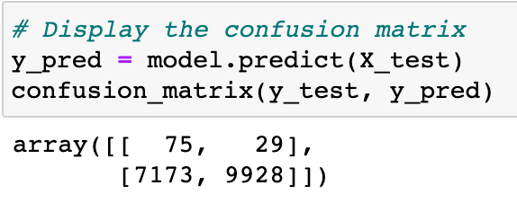

# Credit Risk Analysis

## Purpose
In this analysis, we used the credit card credit dataset from Lending Club to create models that evaluates applications for low or high risk. Each application has many variables, including but not limited to: loan amount, interest rate, annual income, home ownership, etc..

### Models used for analysis
The following six machine learning models are used to check for accuracy in determining risk:
  
  1. Naive Random Oversampling
  2. SMOTE
  3. Random Undersampling
  4. SMOTE-ENN
  5. Balanced Random Forest Classifying
  6. Easy Ensemble Classifying

### Initial Counts of Minority/Majority Classes in the Dataset
When we split the data into low risk and high risk, the count of each in the dataset is as follows (where 0 is high-risk and 1 is low-risk):

0.5% of the dataset is classified as high-risk, which is a very small subset of the dataset and showing us that this is imbalanced data. When we separate our data into training and testing groups, our training group has the following count:

## Model-Specific Performance
### Naive Random Oversampling
Random oversampling duplicates the records of the minority class (data that is identified as high-risk) to match the size of the majority class. Using random oversampling to resample our training dataset produces the following counts for the high-risk and low-risk groups:

#### Confusion Matrix
The confusion matrix using Naive Random Oversampling shows that this model was able to identify low-risk data at much greater rates than high-risk data.

#### Performance of the Logistic Regression Model using Naive Random Oversampling
- Accuracy Score: 58.11%
- Precision: 1%
- Recall: 70%

### SMOTE
SMOTE (Synthetic Minority Over-sampling TEchnique) creates new records in the vicinity of those of the minority class (data that is identified as high-risk) to match the size of the majority class. Using SMOTE to resample our training dataset produces the following counts for the high-risk and low-risk groups:

#### Confusion Matrix
The confusion matrix using SMOTE shows that, similar to random oversampling, this model was able to identify low-risk data at much greater rates than high-risk data.

#### Performance of the Logistic Regression Model using SMOTE
- Accuracy Score: 64.76%
- Precision: 1%
- Recall: 74%

### Random Undersampling
Random undersampling reduces the count of the training set of the majority class to match that of the minority set. Using random undersampling to resample our training dataset produces the following counts for the high-risk and low-risk groups:

#### Confusion Matrix
The confusion matrix using random undersamplish show that, similar to random oversampling and SMOTE, this model was able to identify low-risk data at much greater rates than high-risk data.

#### Performance of the Logistic Regression Model using Random Undersampling
- Accuracy Score: 65.08%
- Precision: 1%
- Recall: 54%

### Random Undersampling
Random undersampling reduces the count of the training set of the majority class to match that of the minority set. Using random undersampling to resample our training dataset produces the following counts for the high-risk and low-risk groups:

#### Confusion Matrix
The confusion matrix using random undersamplish shows that, similar to random oversampling and SMOTE, this model was able to identify low-risk data at much greater rates than high-risk data.

#### Performance of the Logistic Regression Model using Random Undersampling
- Accuracy Score: 65.08%
- Precision: 1%
- Recall: 54%

### SMOTE-ENN
SMOTE-ENN (SMOTE and K-Nearest Neighbors) oversamples the minority class and undersamples the majority class. It creates synthetic values to add to the minority class, and then removes data from the majority class if its nearest neighbors are misclassified. Using SMOTE-ENN to resample our training dataset produces the following counts for the high-risk and low-risk groups:

#### Confusion Matrix
The confusion matrix using SMOTE-ENN shows that, similar to random oversampling, SMOTE, and random undersampling, this model was able to identify low-risk data at much greater rates than high-risk data. However, it predicted correctly more of the high-risk applications than the other methods so far.

#### Performance of the Logistic Regression Model using SMOTE-ENN
- Accuracy Score: 64.77%
- Precision: 1%
- Recall: 58%

### Balanced Random Forest Classifying
BRF (Balanced random forest) classifying undersamples our data to balance it. Using BRF to resample our training dataset produces the following counts for the high-risk and low-risk groups:

#### Confusion Matrix
The confusion matrix using BRF shows that it is better at predicting high-risk applications than some of the other methods.

#### Performance of the Logistic Regression Model using BRF
- Accuracy Score: 77.88%
- Precision: 3%
- Recall: 88%

### Easy Ensemble Classifying
Easy ensemble classifying creates balanced samples of the training dataset by selecting all examples from the minority class and a subset from the majority class. Using easy ensemble to resample our training dataset produces the following counts for the high-risk and low-risk groups:

#### Confusion Matrix
The confusion matrix using easy ensemble shows that it is better at predicting high-risk applications than some of the other methods.

#### Performance of the Logistic Regression Model using Easy Ensemble
- Accuracy Score: 92.93%
- Precision: 7%
- Recall: 93%

